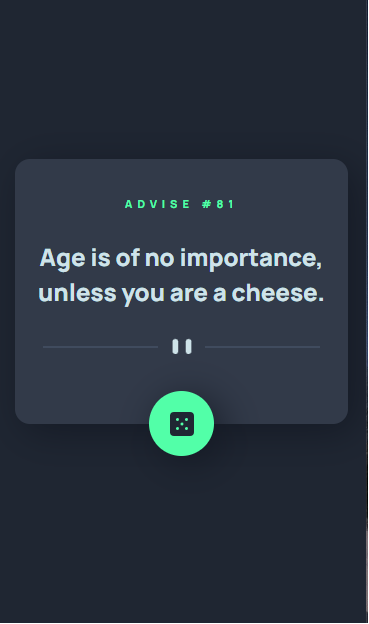

# Frontend Mentor - Advice generator app

## By OlaOluwalekan


## Welcome! 👋

Thanks for checking out this front-end coding challenge.

[Frontend Mentor](https://www.frontendmentor.io) challenges help you improve your coding skills by building realistic projects.

## Table of contents

- [Overview](#overview)
  - [The challenge](#the-challenge)
  - [Screenshot](#screenshot)
  - [Links](#links)
- [My process](#my-process)
  - [Built with](#built-with)
  - [What I learned](#what-i-learned)
  - [Continued development](#continued-development)
  - [Useful resources](#useful-resources)
- [Author](#author)
- [Acknowledgments](#acknowledgments)

**This challenge comprises of HTML, CSS, JavaScript and API**

## Overview

### The challenge

This challenge is to build out an advice generator app using the [Advice Slip API](https://api.adviceslip.com) and get it looking as close to the design as possible.

The goal is for users should be able to:

- View the optimal layout for the app depending on their device's screen size
- See hover states for all interactive elements on the page
- Generate a new piece of advice by clicking the dice icon

### Screenshot

Below are the screenshots of the result after completing the project




### Links

- Solution URL: [Add solution URL here](https://github.com/OlaOluwalekan/advice-generator-app-main)
- Live Site URL: [Add live site URL here](https://advicemi.netlify.app/)

## My process

### Built with

- Semantic HTML5 markup
- CSS custom properties
- Flexbox
- JavaScript (ES6)
- Mobile-first workflow
- [Advice Slip API](https://api.adviceslip.com) - Advice API

### What I learned

This challenge gave me an avenue to hone my **HTML** and **CSS** skills. But my major take home from this is integrating **API** with my JavaScrip Code and displaying data from the API into HTML tags.

To see how you can add code snippets, see below:

```html
<h1>Some HTML code I'm proud of</h1>
```

I'm particularly happy with my styling of the die image and giving it cool transitions

```css
.die-container {
  background-color: var(--neonGreen);
  display: flex;
  justify-content: center;
  align-items: center;
  width: var(--dieWidth);
  height: var(--dieWidth);
  border-radius: 50%;
  position: absolute;
  bottom: -32.5px;
  transform: rotate(0deg);
  transition: transform 1s ease;
  cursor: pointer;
  box-shadow: 8px 8px 40px var(--darkerGreyishBlue);
}
```

The code snippet below 👇 imports the API into my JavaScript and embed it to my HTML tag

```js
fetch("https://api.adviceslip.com/advice")
  .then((response) => {
    console.log(response);
    return response.json();
  })
  .then((data) => {
    let advise = data.slip;
    console.log(advise);
    adviceId.innerHTML = "advise #" + advise.id;
    adviceText.innerHTML = advise.advice;
  });
```

### Continued development

Working with API is still somehoe new to me and at present, I still have to make reference to videos and tutorials to be able to get a grip. Hence, I hope to continue to solidify my knowledge in this ascpect by building more projects that uses API

### Useful resources

- [Example resource 1](https://www.w3schools.com/) - This helped me whenever i need to make a quick reference to CSS styles and selectors.
- [Example resource 2](https://youtube.com) - This is an amazing platform for me to watch videos of people who have built something cool with API. I'd recommend it to anyone still learning this concept.

## Author

- Website - [Olalekan Bello](https://www.your-site.com)
- Frontend Mentor - [@OlaOluwalekan](https://www.frontendmentor.io/profile/OlaOluwalekan)
- Twitter - [@OlaOluealekanMi](https://www.twitter.com/OlaOluealekanMi)

## Acknowledgments

A big thumbs up 👍 to my virtual coding mentor, **John Smilga** [John Smilga](johnsmilga.com). Many helpful tips are from his tutorials videos. Thanks a bunch.

**It's fun building!** 🚀
